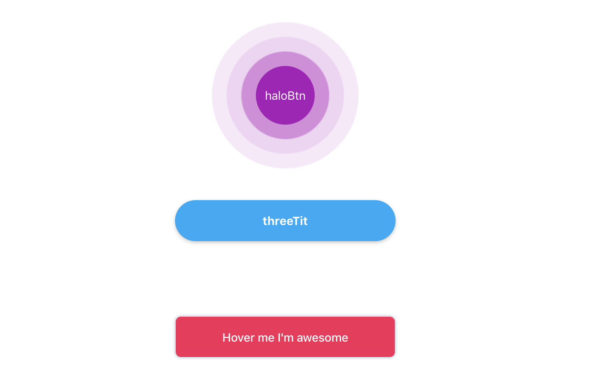

# vue-3d-button

A Vue component to 3d-button
一些3d已经特殊效果的按钮

 ## demo演示
 [demo](https://wei-zhe.github.io/#/threeBtn)

  
 ## 安装
 
 ```JS
 npm install vue-3d-button
 ```
 
 ## 使用
 
 ```js

    import ButtonThree from 'vue-3d-button'
    
    Vue.use(ButtonThree)

    <ButtonThree 
                    type="haloBtn" 
                    width="80px"
                    height="80px" 
                    bgColor='rgb(171, 2, 185)'
                    round='100%'
                    :autofocus='true'
    >haloBtn</ButtonThree>

 ```
### type（String）
按钮的样式 colorful / threeBtn / haloBtn

### width， height（String）
可自定义宽高，默认：auto

### round （String）
可以自定义圆角，默认：2em

### nativeType（String）
原生type属性  button / submit / reset

### bgColor（String）
背景颜色 默认：'rgba(247, 35, 89, 1)' 在colorful类型下暂且只支持 rgba，其他情况支持background的所有属性

### fontColor（String）
文字颜色 '#fff'

### fontSize（String）
文字大小，默认：'1em'

### threeTit（String）
3d按钮文案

### colorful（String）
colorful按钮的hover色 默认：'#4405f7'

### autofocus（Boolean）
是否默认聚焦
